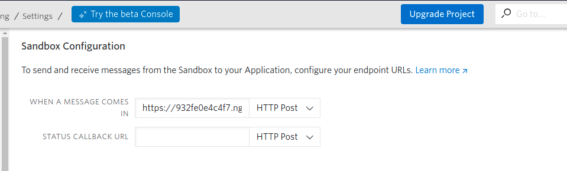

<p align="center">

<h1 align="center"> Cowin WhatsApp Bot </h1>
<p>


### Tech Stack

1. JavaScript
2. [NodeJS](https://nodejs.org/en/)
3. [expressJS](https://expressjs.com/)
4. Twilio Messaging API


### How to use
1. Create a twilio account
2. Store the credientials in a .env file
    ```
    BASE_URL=<cowin-api>
    TWILIO_ACCOUNT=<ACCOUNT SID>
    TWILIO_TOKEN=<AUTH TOKEN>
    ```
3. Go to Programmable Messaging->settings-> whatsapp sandbox settings in twilio.
    
4. Set up the sandbox with your app url.<br/>
    
5. Twilio will provide a whatsapp number to start messaging or you can create your own

### Local setup

1. Fork the repository and clone it to your local machine
2. Install dependencies
    ```
    npm install
    ```
3. Run the app
    ```
    npm start
    ```
4. Expose your local development server to the Internet (eg. using ngrok)
    
5. Run it in your terminal
6. Paste the URL from ngrok in the whatsapp sandbox settings
7. Start messaging


